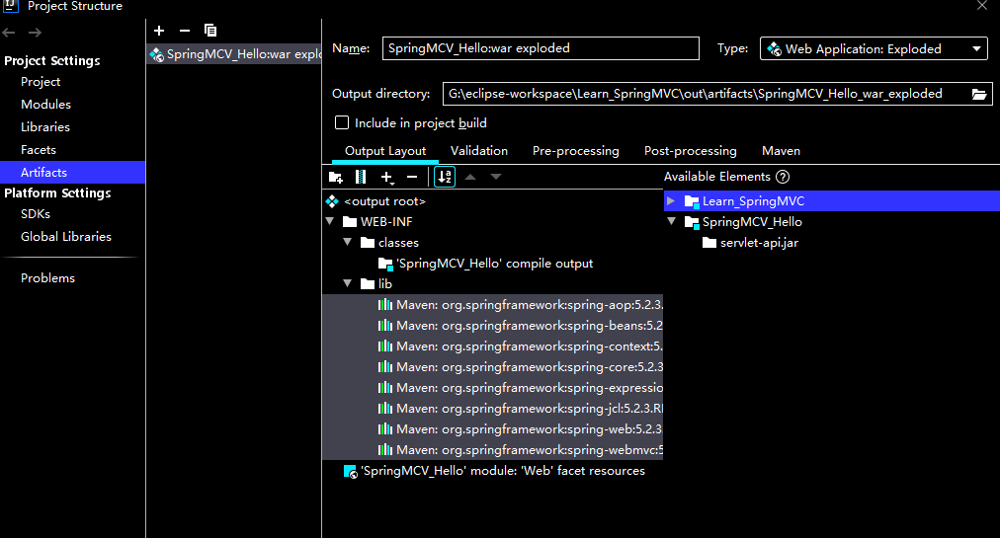

### 什么是MVC？

​	MVC是模型(Model)、视图(View)、控制器(Controller)的简写，是一种软件设计规范。就是将业务逻辑、数据、显示分离的方法来组织代码。MVC主要作用是**降低了视图与业务逻辑间的双向偶合**。MVC不是一种设计模式，**MVC是一种架构模式**。当然不同的MVC存在差异。

​	**Model（模型）：**数据模型，提供要展示的数据，因此包含数据和行为，可以认为是领域模型或JavaBean组件（包含数据和行为），不过现在一般都分离开来：Value Object（数据Dao） 和 服务层（行为Service）。也就是模型提供了模型数据查询和模型数据的状态更新等功能，包括数据和业务。

​		**View（视图）：**负责进行模型的展示，一般就是我们见到的用户界面，客户想看到的东西。

​		**Controller（控制器）：**接收用户请求，委托给模型进行处理（状态改变），处理完毕后把返回的模型数据返回给视图，由视图负责展示。 也就是说控制器做了个调度员的工作。


### SpringMVC的执行流程


### 基于XML的Hello_SpringMVC

1.添加pom依赖

```xml
<dependencies>
    <!-- https://mvnrepository.com/artifact/org.springframework/spring-context -->
    <dependency>
        <groupId>org.springframework</groupId>
        <artifactId>spring-context</artifactId>
        <version>5.2.3.RELEASE</version>
    </dependency>
    <!-- https://mvnrepository.com/artifact/org.springframework/spring-web -->
    <dependency>
        <groupId>org.springframework</groupId>
        <artifactId>spring-web</artifactId>
        <version>5.2.3.RELEASE</version>
    </dependency>
    <!-- https://mvnrepository.com/artifact/org.springframework/spring-webmvc -->
    <dependency>
        <groupId>org.springframework</groupId>
        <artifactId>spring-webmvc</artifactId>
        <version>5.2.3.RELEASE</version>
    </dependency>
</dependencies>
```

2、编写web.xml文件

```xml
<?xml version="1.0" encoding="UTF-8"?>
<web-app xmlns="http://xmlns.jcp.org/xml/ns/javaee"
         xmlns:xsi="http://www.w3.org/2001/XMLSchema-instance"
         xsi:schemaLocation="http://xmlns.jcp.org/xml/ns/javaee http://xmlns.jcp.org/xml/ns/javaee/web-app_4_0.xsd"
         version="4.0">
    <!--配置DispatcherServlet-->
    <servlet>
        <servlet-name>springmvc</servlet-name>
        <servlet-class>org.springframework.web.servlet.DispatcherServlet</servlet-class>
        <!--关联springmvc的配置文件-->
        <init-param>
            <param-name>contextConfigLocation</param-name>
            <param-value>classpath:applicationContext.xml</param-value>
        </init-param>
    </servlet>
    <!--匹配servlet的请求，/标识匹配所有请求-->
    <servlet-mapping>
        <servlet-name>springmvc</servlet-name>
        <!--/*和/都是拦截所有请求，/会拦截的请求不包含*.jsp,而/*的范围更大，还会拦截*.jsp这些请求-->
        <url-pattern>/</url-pattern>
    </servlet-mapping>
</web-app>
```

3、编写springmvc需要的spring配置文件，applicationContext.xml

```xml
<?xml version="1.0" encoding="UTF-8"?>
<beans xmlns="http://www.springframework.org/schema/beans"
       xmlns:xsi="http://www.w3.org/2001/XMLSchema-instance"
       xsi:schemaLocation="http://www.springframework.org/schema/beans http://www.springframework.org/schema/beans/spring-beans.xsd">


    <!--处理映射器-->
    <bean class="org.springframework.web.servlet.handler.BeanNameUrlHandlerMapping"/>
    <!--处理器适配器-->
    <bean class="org.springframework.web.servlet.mvc.SimpleControllerHandlerAdapter"/>

    <!--视图解析器-->
    <bean id="internalResourceViewResolver" class="org.springframework.web.servlet.view.InternalResourceViewResolver">
        <!--配置前缀-->
        <property name="prefix" value="/WEB-INF/jsp/"/>
        <!--配置后缀-->
        <property name="suffix" value=".jsp"/>
    </bean>

    <bean id="/hello" class="com.onisun.hello.controller.HelloController"/>
</beans>
```


4、HelloController.java

```java
package com.onisun.hello.controller;

import org.springframework.web.servlet.ModelAndView;
import org.springframework.web.servlet.mvc.Controller;

/**
 * @author Neo
 * @version 1.0
 */
public class HelloController implements Controller {

    public ModelAndView handleRequest(javax.servlet.http.HttpServletRequest httpServletRequest, javax.servlet.http.HttpServletResponse httpServletResponse) throws Exception {
        //创建模型和视图对象
        ModelAndView view = new ModelAndView();
        //设置要跳转的视图
        view.setViewName("hello");
        //将需要的值传递到model中
        view.addObject("msg","Hello SpringMVC .......");
        return view;
    }
}
```


5、创建hello.jsp页面

```jsp
<%--
  Created by IntelliJ IDEA.
  User: Administrator
  Date: 2022/3/8
  Time: 15:05
  To change this template use File | Settings | File Templates.
--%>
<%@ page contentType="text/html;charset=UTF-8" language="java" %>
<html>
<head>
    <title>Title</title>
</head>
<body>
${msg}
</body>
</html>
```


异常: DispatcherServlet ClassNotFound


解决：

​		选中项目点击File-->Project Structure-->Artifacts-->Output layout

​		在WEB-INF目录下右击创建文件夹lib

​		右击lib-->Add copy of --> Library Files

​		选择所有的pom依赖，添加进来就OK了




