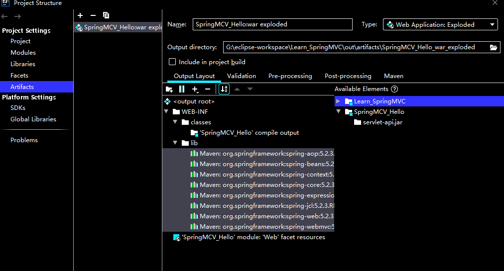

### 什么是MVC？

​	MVC是模型(Model)、视图(View)、控制器(Controller)的简写，是一种软件设计规范。就是将业务逻辑、数据、显示分离的方法来组织代码。MVC主要作用是**降低了视图与业务逻辑间的双向偶合**。MVC不是一种设计模式，**MVC是一种架构模式**。当然不同的MVC存在差异。

​	**Model（模型）：**数据模型，提供要展示的数据，因此包含数据和行为，可以认为是领域模型或JavaBean组件（包含数据和行为），不过现在一般都分离开来：Value Object（数据Dao） 和 服务层（行为Service）。也就是模型提供了模型数据查询和模型数据的状态更新等功能，包括数据和业务。

​		**View（视图）：**负责进行模型的展示，一般就是我们见到的用户界面，客户想看到的东西。

​		**Controller（控制器）：**接收用户请求，委托给模型进行处理（状态改变），处理完毕后把返回的模型数据返回给视图，由视图负责展示。 也就是说控制器做了个调度员的工作。


### SpringMVC的执行流程


### 基于XML的Hello_SpringMVC

1.添加pom依赖

```xml
<dependencies>
    <!-- https://mvnrepository.com/artifact/org.springframework/spring-context -->
    <dependency>
        <groupId>org.springframework</groupId>
        <artifactId>spring-context</artifactId>
        <version>5.2.3.RELEASE</version>
    </dependency>
    <!-- https://mvnrepository.com/artifact/org.springframework/spring-web -->
    <dependency>
        <groupId>org.springframework</groupId>
        <artifactId>spring-web</artifactId>
        <version>5.2.3.RELEASE</version>
    </dependency>
    <!-- https://mvnrepository.com/artifact/org.springframework/spring-webmvc -->
    <dependency>
        <groupId>org.springframework</groupId>
        <artifactId>spring-webmvc</artifactId>
        <version>5.2.3.RELEASE</version>
    </dependency>
</dependencies>
```

2、编写web.xml文件

```xml
<?xml version="1.0" encoding="UTF-8"?>
<web-app xmlns="http://xmlns.jcp.org/xml/ns/javaee"
         xmlns:xsi="http://www.w3.org/2001/XMLSchema-instance"
         xsi:schemaLocation="http://xmlns.jcp.org/xml/ns/javaee http://xmlns.jcp.org/xml/ns/javaee/web-app_4_0.xsd"
         version="4.0">
    <!--配置DispatcherServlet-->
    <servlet>
        <servlet-name>springmvc</servlet-name>
        <servlet-class>org.springframework.web.servlet.DispatcherServlet</servlet-class>
        <!--关联springmvc的配置文件-->
        <init-param>
            <param-name>contextConfigLocation</param-name>
            <param-value>classpath:applicationContext.xml</param-value>
        </init-param>
    </servlet>
    <!--匹配servlet的请求，/标识匹配所有请求-->
    <servlet-mapping>
        <servlet-name>springmvc</servlet-name>
        <!--/*和/都是拦截所有请求，/会拦截的请求不包含*.jsp,而/*的范围更大，还会拦截*.jsp这些请求-->
        <url-pattern>/</url-pattern>
    </servlet-mapping>
</web-app>
```

3、编写springmvc需要的spring配置文件，applicationContext.xml

```xml
<?xml version="1.0" encoding="UTF-8"?>
<beans xmlns="http://www.springframework.org/schema/beans"
       xmlns:xsi="http://www.w3.org/2001/XMLSchema-instance"
       xsi:schemaLocation="http://www.springframework.org/schema/beans http://www.springframework.org/schema/beans/spring-beans.xsd">


    <!--处理映射器-->
    <bean class="org.springframework.web.servlet.handler.BeanNameUrlHandlerMapping"/>
    <!--处理器适配器-->
    <bean class="org.springframework.web.servlet.mvc.SimpleControllerHandlerAdapter"/>

    <!--视图解析器-->
    <bean id="internalResourceViewResolver" class="org.springframework.web.servlet.view.InternalResourceViewResolver">
        <!--配置前缀-->
        <property name="prefix" value="/WEB-INF/jsp/"/>
        <!--配置后缀-->
        <property name="suffix" value=".jsp"/>
    </bean>

    <bean id="/hello" class="com.onisun.hello.controller.HelloController"/>
</beans>
```


4、HelloController.java

```java
package com.onisun.hello.controller;

import org.springframework.web.servlet.ModelAndView;
import org.springframework.web.servlet.mvc.Controller;

/**
 * @author Neo
 * @version 1.0
 */
public class HelloController implements Controller {

    public ModelAndView handleRequest(javax.servlet.http.HttpServletRequest httpServletRequest, javax.servlet.http.HttpServletResponse httpServletResponse) throws Exception {
        //创建模型和视图对象
        ModelAndView view = new ModelAndView();
        //设置要跳转的视图
        view.setViewName("hello");
        //将需要的值传递到model中
        view.addObject("msg","Hello SpringMVC .......");
        return view;
    }
}
```


5、创建hello.jsp页面

```jsp
<%--
  Created by IntelliJ IDEA.
  User: Administrator
  Date: 2022/3/8
  Time: 15:05
  To change this template use File | Settings | File Templates.
--%>
<%@ page contentType="text/html;charset=UTF-8" language="java" %>
<html>
<head>
    <title>Title</title>
</head>
<body>
${msg}
</body>
</html>
```


异常: DispatcherServlet ClassNotFound


解决：

​		选中项目点击File-->Project Structure-->Artifacts-->Output layout

​		在WEB-INF目录下右击创建文件夹lib

​		右击lib-->Add copy of --> Library Files

​		选择所有的pom依赖，添加进来就OK了




### 基于注解的SpringMVC

1、添加pom依赖

```xml
<dependencies>
    <!-- https://mvnrepository.com/artifact/org.springframework/spring-context -->
    <dependency>
        <groupId>org.springframework</groupId>
        <artifactId>spring-context</artifactId>
        <version>5.2.3.RELEASE</version>
    </dependency>
    <!-- https://mvnrepository.com/artifact/org.springframework/spring-web -->
    <dependency>
        <groupId>org.springframework</groupId>
        <artifactId>spring-web</artifactId>
        <version>5.2.3.RELEASE</version>
    </dependency>
    <!-- https://mvnrepository.com/artifact/org.springframework/spring-webmvc -->
    <dependency>
        <groupId>org.springframework</groupId>
        <artifactId>spring-webmvc</artifactId>
        <version>5.2.3.RELEASE</version>
    </dependency>
</dependencies>
```


2.   编写xml文件配置DispatcherServlet

     ```xml
     <!--配置DispatcherServlet-->
     <servlet>
         <servlet-name>springmvc</servlet-name>
         <servlet-class>org.springframework.web.servlet.DispatcherServlet</servlet-class>
         <!--关联springmvc的配置文件-->
         <init-param>
            <!--
     		关联springmvc的配置文件
     		此配置文件的属性可以不添加，但是需要在WEB-INF的目录下创建 前端控制器名称-servlet.xml文件
     		-->
             <param-name>contextConfigLocation</param-name>
             <param-value>classpath:applicationContext.xml</param-value>
         </init-param>
     </servlet>
     <!--匹配servlet的请求，/标识匹配所有请求-->
     <servlet-mapping>
         <servlet-name>springmvc</servlet-name>
         <!--/*和/都是拦截所有请求，/会拦截的请求不包含*.jsp,而/*的范围更大，还会拦截*.jsp这些请求-->
          <!--匹配servlet的请求，
         /：标识匹配所有请求，但是不会匹配jsp页面
         /*：拦截所有请求，拦截jsp页面
     
          但是需要注意的是，当配置成index.html的时候，会发现请求不到
          原因在于，tomcat下也有一个web.xml文件，所有的项目下web.xml文件都需要继承此web.xml
          在服务器的web.xml文件中有一个DefaultServlet用来处理静态资源，但是url-pattern是/
          而我们在自己的配置文件中如果添加了url-pattern=/会覆盖父类中的url-pattern，此时在请求的时候
          DispatcherServlet会去controller中做匹配，找不到则直接报404
          而在服务器的web.xml文件中包含了一个JspServlet的处理，所以不拦截jsp请求
         -->
         <url-pattern>/</url-pattern>
     </servlet-mapping>
     ```

3.Controller

```java
@Controller
public class HelloController {

    @RequestMapping("/hello")
    public String hello(Model model){
        model.addAttribute("msg","this my first annotation based SpringMVC");
        return "hello";
    }
}
```


### @RequestMapping

@RequestMapping 用来匹配客户端发送的请求，可以在方法上使用，也可以在类上使用

在方法上使用：表示用来匹配要处理的请求

在类上使用：表示当前类的所有方法的请求地址添加一个前置路径，客户端访问的时候必须要添加此路径


```java
@Controller
@RequestMapping("/register")
public class HelloController {

    @RequestMapping("/hello")
    public String hello(Model model){
        model.addAttribute("msg","this my first annotation based SpringMVC");
        return "hello";
    }
}
```

此时的访问地址为: http://localhost:8080/SpringMVC/register/hello


#### @RequestMapping的属性值

value : 要匹配的请求

method: 限制发送请求的方式  get、post

params：表示请求要接收的参数，如果定义了这个属性，那么发送请求时必须要添加这个参数

​	匹配规则：

​		1.直接写参数的名称：param1，param2

​				params = {"username"}

​		2.表示请求不能包含该参数： !param1

​				params = {"!username"}

​		3.表示请求需要包含的参数，必须限制值  param1 = values  param != vaules

​				params = {"username = 123","age"}

​				params = {"username != 123","age"}

headers: 填写请求头信息

comsumers : 限制响应中的content-type

produces : 限制请求中的content-type，Contenx-type:text/html;charset=utf=8


**通配符匹配**

？ 能代替任意一个字符

   * 能代替任意多个字符和一层路径

** 能代替多层路径

```java
/**
 * @Request包含三种模糊匹配的方式，分别是：
 *  ？：能替代任意一个字符
 *  *: 能替代任意多个字符和一层路径
 *  **：能代替多层路径
 * @return
 */
@RequestMapping(value = "/**/h*llo?")
public String hello5(){
    System.out.println("hello5");
    return "hello";
}
```


### @PathVariable


```java
@Controller
public class ParvariableController {

    @RequestMapping("/login")
    public String login(String name){
        //自动获取到了请求地址中的参数
        System.out.println(name);
        return "hello";
    }
}
```


使用@PathVariable获取请求路径

```java
@RequestMapping("/login/{page}")
public String login(@PathVariable String page) {
    //访问地址：http://localhost:8080/SpringMVC/login/hahaha
    //此时@PathVariable 获取的page值是:hahaha
    //RequestMapping的值和PathVariable的参数不一致，可以使用@PathVariable("xxx")
    //如 :@RequestMapping("/login/{page}")   login(@PathVariable("page") String name)
    System.out.println(page);
    return "hello";
}
```


### REST

REST即表述性状态传递（英文：Representational State Transfer，简称REST）是Roy Fielding博士在2000年他的博士论文中提出来的一种[软件架构](https://baike.baidu.com/item/软件架构)风格。它是一种针对[网络应用](https://baike.baidu.com/item/网络应用/2196523)的设计和开发方式，可以降低开发的复杂性，提高系统的可伸缩性。

REST,翻译过来叫做表现层状态转化，是目前最流行的一个互联网软件架构，它架构清晰，符合标准，易于理解，扩展方便。


人话：我们在获取资源的时候就是进行增删改查的操作，如果是原来的架构风格，需要发送四个请求，分别是：

​		查询：localhost:8080/query?id=1

​		增加：localhost:8080/insert

​		删除：localhost:8080/delete?id=1

​		更新：localhost:8080/update?id=1


按照此方式发送请求的时候比较麻烦，需要定义多种请求，而在HTTP协议中，有不同的发送请求的方式，分别是GET、POST、PUT、DELETE等，我们如果能让不同的请求方式表示不同的请求类型就可以简化我们的查询

​		GET：获取资源   			/book/1	

​		POST：新建资源			 /book

​		PUT：更新资源				/book/1

​		DELETE：删除资源		  /book/1


一切看起来都非常美好，但是大家需要注意了，我们在发送请求的时候只能发送post或者get，没有办法发送put和delete请求，那么应该如何处理呢？下面开始进入代码环节：

```java
package com.onisun.demo.controller;

import org.springframework.stereotype.Controller;
import org.springframework.web.bind.annotation.PathVariable;
import org.springframework.web.bind.annotation.RequestMapping;
import org.springframework.web.bind.annotation.RequestMethod;

/**
 * @author Neo
 * @version 1.0
 */
@Controller
public class RestController {

    @RequestMapping(value = "/user",method = RequestMethod.POST)
    public String add(){
        System.out.println("添加");
        return "success";
    }

    @RequestMapping(value = "/user/{id}",method = RequestMethod.DELETE)
    public String delete(@PathVariable("id") Integer id){
        System.out.println("删除 :" + id);
        return "success";
    }

    @RequestMapping(value = "/user/{id}",method = RequestMethod.PUT)
    public String update(@PathVariable("id") Integer id){
        System.out.println("update:" + id);
        return "success";
    }

    @RequestMapping(value = "/user/{id}",method = RequestMethod.GET)
    public String query(@PathVariable("id") Integer id){
        System.out.println("查询 ：" + id);
        return "success";
    }
}
```
